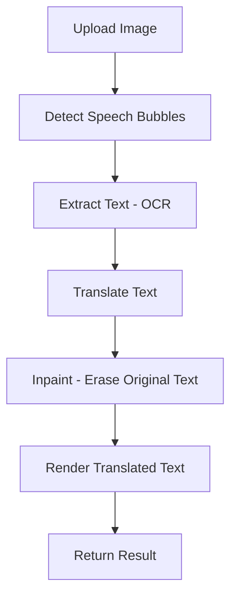

# Backend Setup (Flask + Poetry)

This backend provides a simple Flask API for your project. It uses [Poetry](https://python-poetry.org/) for dependency management.

## Prerequisites

- Python 3.8+
- [Poetry](https://python-poetry.org/docs/#installation)

## Setup Instructions

1. **Clone the repository** (if you haven’t already):

   ```sh
   git clone <your-repo-url>
   cd manga-translator/backend
   ```

2. **Install dependencies with Poetry:**

   ```sh
   poetry install
   ```

3. **Activate the Poetry virtual environment:**

   ```sh
   poetry shell
   ```

4. **Run the Flask app:**

   ```sh
   poetry run python app.py
   ```

   The API will be available at [http://127.0.0.1:5000/api/hello](http://127.0.0.1:5000/api/hello).

## API Example

- **GET** `/api/hello`  
  Returns:  
  ```json
  { "message": "Hello from Flask!" }
  ```

## Development Notes

- Dependencies are managed in `pyproject.toml`.
- To add a new dependency, use:  
  ```sh
  poetry add <package-name>
  ```
- To exit the Poetry shell, type `exit`.

---

## How it Works

This backend provides an automated manga translation pipeline. The main stages are:

1. **Image Upload:**  
   An image is uploaded via the `/api/process` endpoint.

2. **Speech Bubble Detection:**  
   The system detects speech bubbles in the manga image using a YOLO model or fallback contour detection.

3. **Text Extraction (OCR):**  
   Text is extracted from each detected bubble using OCR (MangaOCR or Google OCR).

4. **Translation:**  
   Extracted text is translated from Japanese (or other source language) to English (or target language) using Google Translate or Google GenAI.

5. **Inpainting:**  
   The original text is removed from the image using inpainting (OpenCV or LaMa model).

6. **Text Rendering:**  
   The translated text is rendered back into the cleared bubbles using a manga-style font.

7. **Result:**  
   The final translated image is returned, along with extracted and translated text data.

## Main Modules

- `process/text_extraction.py`: Detects speech bubbles and extracts text via OCR.
- `process/translator.py`: Handles translation of extracted text.
- `process/inpaint.py`: Removes original text from bubbles using inpainting.
- `process/text_render.py`: Draws translated text back into the image.
- `routes/test.py`: Exposes the `/api/process` endpoint for image translation.

## API Endpoints

- **POST** `/process`  
  Upload one or more images for translation.  
  Returns: Translated images (as PNG) and extracted/translated text data.

## High-Level Flow



---